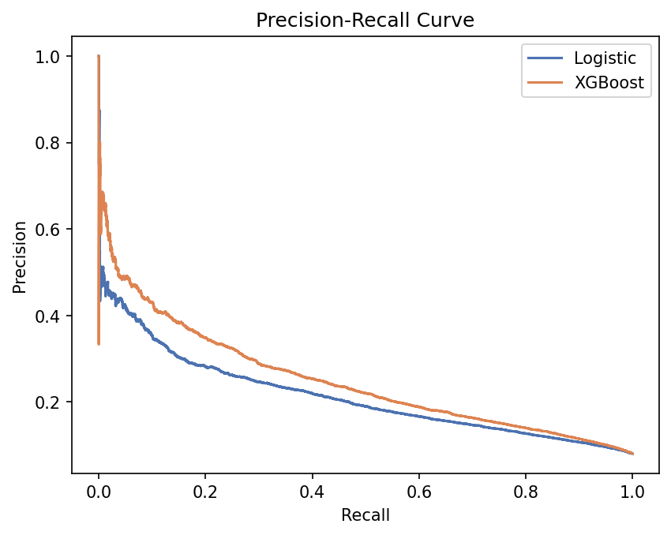
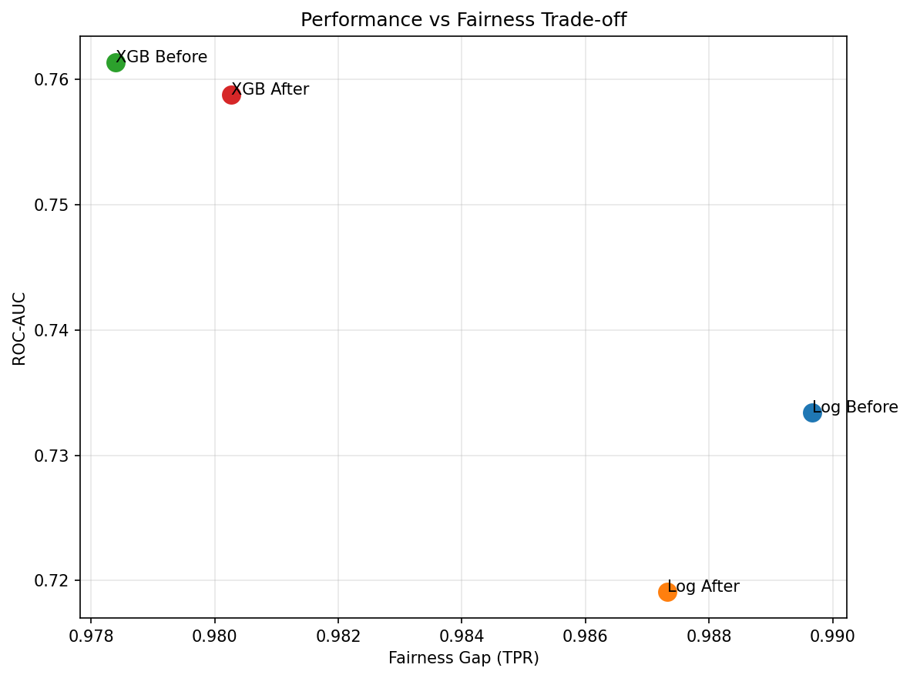
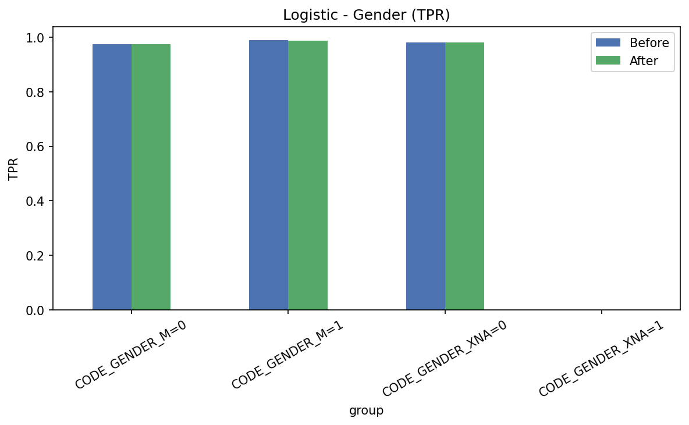
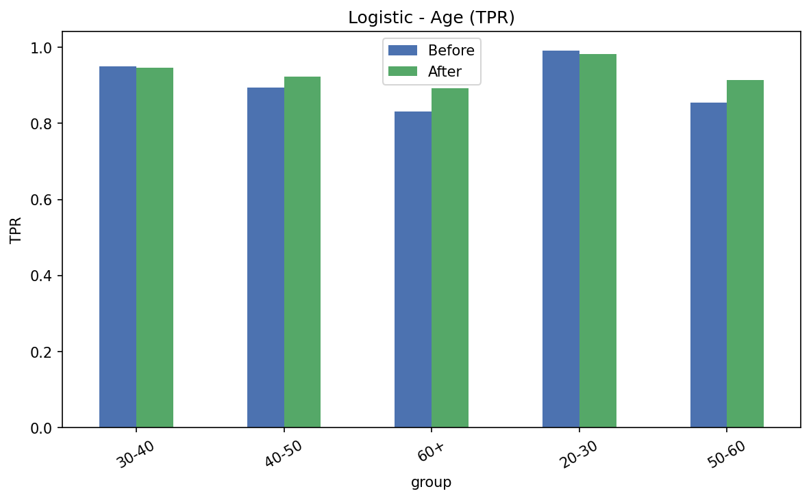
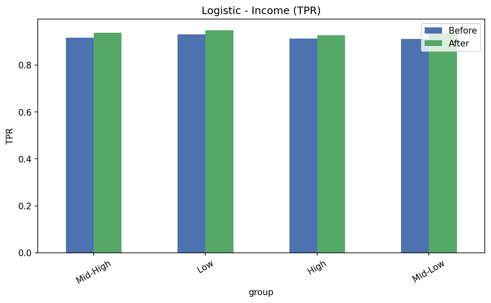
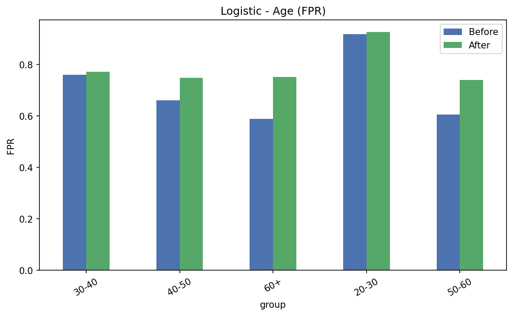
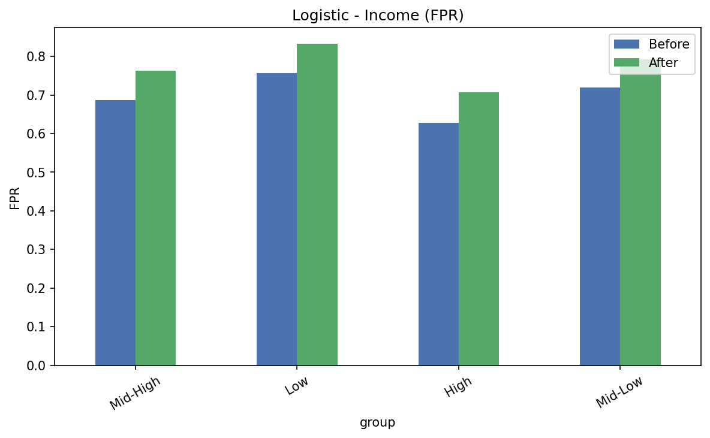
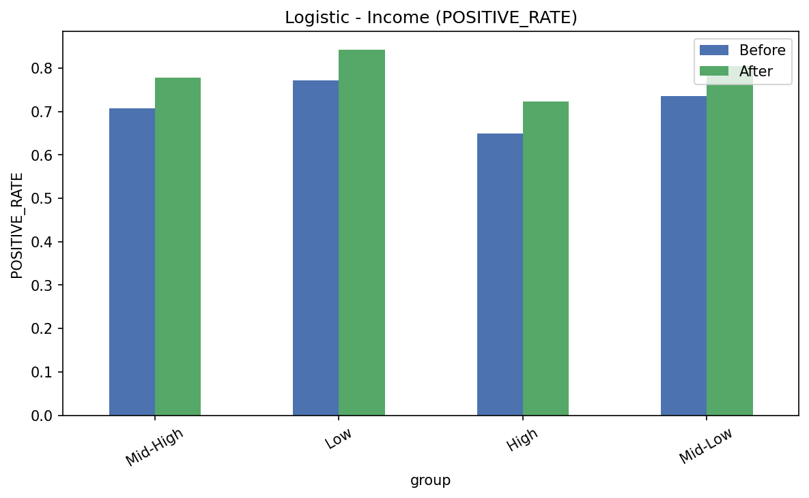
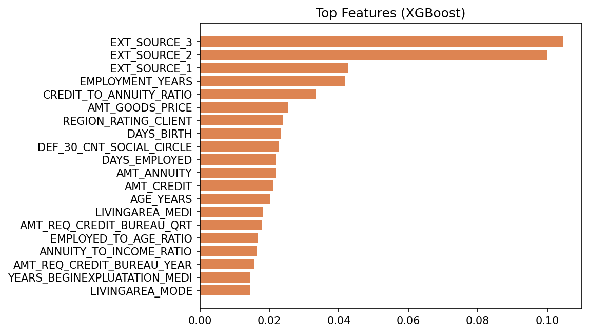
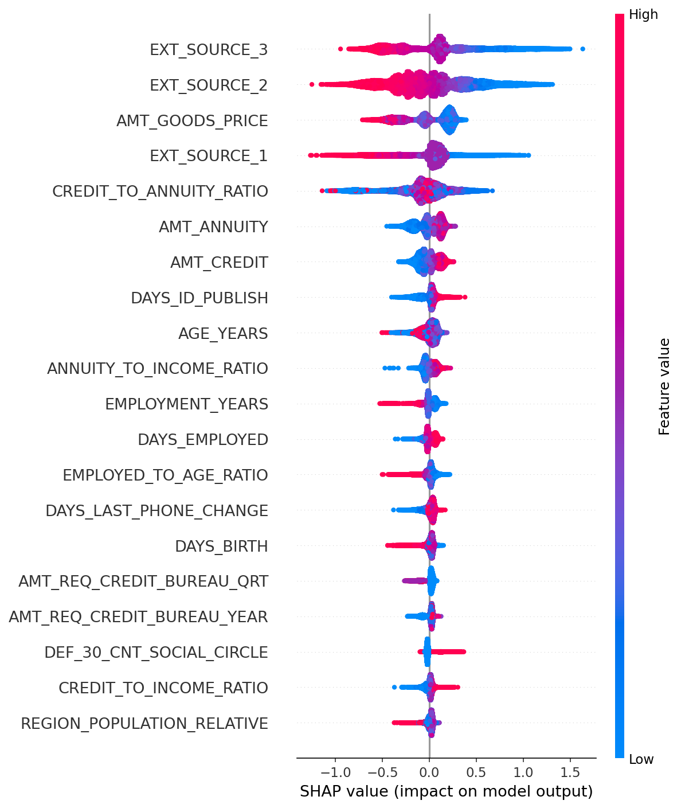

# Credit Risk Modeling with Fairness-Aware Machine Learning

> Predicting loan default risk on 307K applicants using Logistic Regression and XGBoost — with bias auditing across gender, age, and income groups, and statistical model comparison via the DeLong test.

[](https://www.python.org/)
[](https://scikit-learn.org/)
[](https://xgboost.readthedocs.io/)
[](https://shap.readthedocs.io/)
[]()

---

## Table of Contents

- [Project Overview](#project-overview)
- [Dataset](#dataset)
- [Project Structure](#project-structure)
- [Methodology](#methodology)
- [Results](#results)
- [Fairness & Bias Analysis](#fairness--bias-analysis)
- [SHAP Explainability](#shap-explainability)
- [Setup & Installation](#setup--installation)
- [Tech Stack](#tech-stack)
- [Key Takeaways](#key-takeaways)

---

## Project Overview

This project builds a **production-grade credit risk classifier** to predict whether a loan applicant will default (`TARGET = 1`), using the Home Credit dataset. The project goes beyond standard ML pipelines by incorporating:

- **Dual model comparison** — Logistic Regression vs XGBoost with custom thresholds optimized for high recall
- **Statistical significance testing** — DeLong test to validate whether AUC differences are meaningful
- **Bootstrap confidence intervals** — 95% CI on AUC for both models
- **Fairness auditing** — TPR, FPR, and Positive Rate gaps measured across gender, age group, and income bracket
- **Bias mitigation** — Sample reweighting to reduce disparity across demographic groups
- **SHAP explainability** — Feature-level interpretation of XGBoost predictions

The core insight: **in credit risk, recall matters more than accuracy**. Missing a true defaulter (false negative) is far more costly than over-flagging a safe applicant. Both models were tuned with low thresholds (0.3 for Logistic, 0.2 for XGBoost) to reflect this business reality.

---

## Dataset

| Property | Details |
|---|---|
| Source | Home Credit Default Risk (Kaggle) |
| Total Samples | 307,511 |
| Features (after engineering) | 217 |
| Features (after selection) | 50 |
| Target: No Default (0) | 282,686 (91.9%) |
| Target: Default (1) | 24,825 (8.1%) |

The dataset is **heavily imbalanced** — a 91:9 split — which directly informs the threshold choices and evaluation strategy. Standard accuracy is misleading here; ROC-AUC, recall, and fairness metrics are the meaningful signals.

---

## Project Structure

```
credit-risk-modeling/
│
├── app/
│   ├── main.py
│   └── ui.py
│
├── data/
│   ├── processed/
│   │   ├── clean_application_data.csv
│   │   └── feature_engineered_data.csv
│   └── raw/
│
├── models/
│   ├── 01_feature_columns.pkl
│   ├── 02_xgb_model.pkl
│   ├── feature_columns.pkl
│   └── xgb_model.pkl
│
├── notebooks/
│   ├── 01_eda.ipynb
│   ├── 02_data_cleaning.ipynb
│   ├── 03_feature_engineering.ipynb
│   ├── 04_model_experiments.ipynb
│   └── checker.ipynb
│
├── src/
│   ├── bias_analysis.py
│   ├── data_preprocessing.py
│   ├── evaluate_model.py
│   ├── feature_selection.py
│   └── train_model.py
│
├── README.md
└── requirements.txt
```

---

## Methodology

### 1. Feature Engineering & Selection
- 217 features generated from the raw Home Credit dataset (income ratios, employment duration, bureau credit history, etc.)
- Top 50 features selected using feature importance from a preliminary XGBoost pass
- Key engineered features: `CREDIT_TO_ANNUITY_RATIO`, `EMPLOYED_TO_AGE_RATIO`, `ANNUITY_TO_INCOME_RATIO`, `AGE_YEARS`

### 2. Model Training
Both models trained on the same 50-feature set with threshold tuning for high recall:

| Model | Threshold | Rationale |
|---|---|---|
| Logistic Regression | 0.30 | Optimized for recall on imbalanced data |
| XGBoost | 0.20 | More aggressive recall trade-off |

### 3. Statistical Validation
- **Bootstrap AUC (n=1000)** with 95% confidence intervals
- **DeLong Test** for statistical significance of AUC difference between models
- Results: Z = -0.949, p = 0.34 — difference not statistically significant at α = 0.05

### 4. Fairness Audit
Three demographic axes evaluated before and after bias mitigation:
- **Gender** — `CODE_GENDER_M=0/1`, `CODE_GENDER_XNA`
- **Age Group** — 20-30, 30-40, 40-50, 50-60, 60+
- **Income Bracket** — Low, Mid-Low, Mid-High, High (quartile split)

Fairness metrics: True Positive Rate (Equality of Opportunity), False Positive Rate, Demographic Parity (Positive Rate)

### 5. Bias Mitigation
Sample reweighting applied during training — gender group weights inversely proportional to group size — to reduce TPR disparity without retraining from scratch.

---

## Results

### Model Performance

| Model | AUC (95% CI) | Recall | Threshold |
|---|---|---|---|
| Logistic Regression | 0.733 (0.726, 0.741) | 0.920 | 0.30 |
| XGBoost | 0.761 (0.754, 0.768) | 0.966 | 0.20 |

### DeLong Test
```
Z-statistic : -0.949
P-value     : 0.343
```
The AUC gap between models is **not statistically significant** — XGBoost's higher AUC may be due to chance at this sample split.

### Precision-Recall & ROC Curves



XGBoost consistently dominates Logistic Regression across the precision-recall curve, particularly at lower recall thresholds.

### Performance vs Fairness Trade-off



XGBoost achieves better AUC with a smaller fairness gap. Post-mitigation Logistic Regression moves toward the ideal top-left quadrant (high AUC, low gap).

---

## Fairness & Bias Analysis

### Logistic Regression — TPR by Group (Before vs After Mitigation)

**Gender**



**Age Group**



**Income Bracket**


### Logistic Regression — FPR by Group

**Gender**



**Age**



**Income**



### Logistic Regression — Demographic Parity (Positive Rate)

**Gender**


**Age**


**Income**



### Key Fairness Observations

- **Gender**: TPR is near-uniform across male/female groups (~0.97–0.99), suggesting gender parity in recall
- **Age**: The 60+ group has noticeably lower TPR (~0.83) compared to the 20-30 group (~0.99) — a meaningful disparity. Mitigation improves TPR for older groups
- **Income**: FPR rises post-mitigation for low-income applicants — a precision-fairness trade-off worth monitoring
- **Mitigation effect**: Sample reweighting closes the TPR gap across age groups without significantly hurting AUC

---

## SHAP Explainability

### Top Features (XGBoost)



### SHAP Beeswarm Plot



**Key findings from SHAP analysis:**

- `EXT_SOURCE_3` and `EXT_SOURCE_2` (external credit scores) are the two most impactful features by a wide margin — high values strongly reduce predicted default risk
- `EMPLOYMENT_YEARS` and `EXT_SOURCE_1` follow as the next strongest predictors
- `CREDIT_TO_ANNUITY_RATIO` — a higher loan-to-payment ratio increases default risk
- `AGE_YEARS` contributes positively (older applicants are lower risk), confirming the age-group fairness gap seen above
- `AMT_GOODS_PRICE` and `AMT_CREDIT` show bidirectional effects depending on value magnitude

---

## Setup & Installation

```bash
# Clone the repository
git clone https://github.com/brindhasuvarna2005-sudo/credit-risk-modeling.git
cd credit-risk-modeling

# Install dependencies
pip install -r requirements.txt

# Run the notebook
jupyter notebook notebooks/credit_risk_modeling.ipynb
```

### Requirements

```
pandas
numpy
scikit-learn
xgboost
shap
matplotlib
seaborn
scipy
joblib
jupyter
```

---

## Tech Stack

| Category | Tools |
|---|---|
| Language | Python 3.10 |
| ML Models | scikit-learn (Logistic Regression), XGBoost |
| Explainability | SHAP |
| Statistics | SciPy (DeLong test), NumPy (Bootstrap CI) |
| Visualization | Matplotlib, Seaborn |
| Notebook | Jupyter |
| Serialization | Joblib |

---

## Key Takeaways

1. **Threshold matters more than model choice** — at default 0.5 threshold, both models perform poorly on imbalanced data; tuned thresholds unlock high recall
2. **AUC gap is not statistically significant** — XGBoost's 0.028 AUC advantage over Logistic Regression does not pass the DeLong test (p = 0.34)
3. **Age is the most biased axis** — 60+ applicants have ~16% lower TPR than 20-30 applicants before mitigation
4. **Sample reweighting helps, with trade-offs** — it closes the age TPR gap but slightly increases FPR for low-income groups
5. **External credit scores dominate** — `EXT_SOURCE_1/2/3` account for the majority of predictive signal; domain-specific features add modest but meaningful improvement
6. **Fairness and performance can coexist** — XGBoost After mitigation achieves the best balance of AUC and fairness gap in the performance-fairness trade-off plot

---

## Author

**Brindha Suvarna R**
Credit Risk Modeling — Fairness-Aware ML Project

---

## License

This project is for academic and research purposes.
